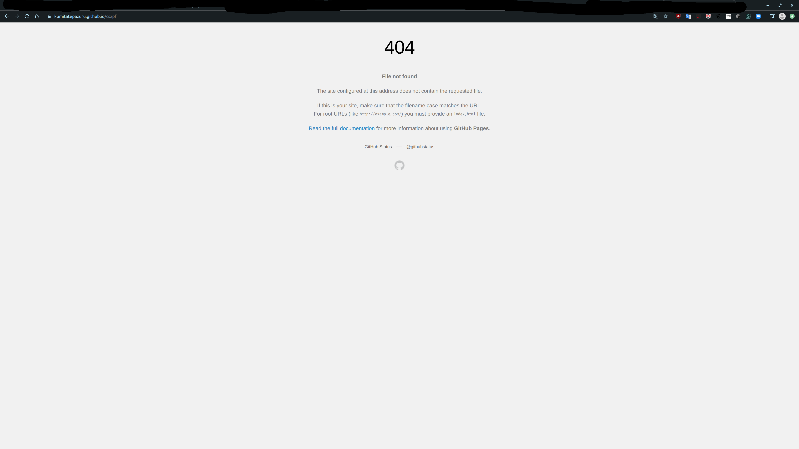

---

---

# 404 Not Found!

あなたが指定したページはありませんよ。でも、これだけじゃ面白くないのでちょっと雑談をしましょう。

## 自分が404ページを書いた理由

なぜ、こんなページを書いたかです。まず、下の写真を見てください。クリックで拡大します。

これは、github pagesの404ページです。真ん中に404と書いてあり、下に小さくFile not foundと表示されています。そして、下に、ファイルがないというメッセージが表示されています。

次に、下の1行の文を見てください。この記事の題名にもなっている言葉です。

# 404 Not Found!

これを見ると、僕だけかもしれませんが、目をそらしたくなります。

この違いは、とてもシンプルに大きく**404**と表示されていることです。もし、こんなのがひょうじされたら、何がないのかわからないし、少し、恐怖を感じます。（自分だけかもしれないけど）

だから、今回このような形で404ページを書きました。

## 404 Not Foundの歴史

※[こちらのページ](https://wired.jp/2018/01/25/history-of-the-404-error/)を要約しながら説明していこうと思います。作成者の方、ありがとうございます。

さて、404のエラーは登場してから程なく、2000年の初めには様々な「噂」が広まったそう。

例えば...

> 「404という数字は実は404号室に由来している。その部屋は世界初のウェブサーバーが置かれたところで、スイスの欧州原子核研究機構（CERN）内にある」
>
> 「ワールド・ワイド・ウェブ（WWW）を考案したティム・バーナーズ＝リーがその部屋にオフィスを構えた。彼はしょっちゅう行方をくらましていた」──といった具合だ。
>
> ※一部見やすくするために改変をしています。

その噂に、WWWを開発したひとりの[ロバート・カイリュー](https://ja.wikipedia.org/wiki/ロバート・カイリュー)は「そんな伝説はでたらめだ」と言ったそう。そして、

> エラーコードは必要なものではあったが、“主役”ではなかった。新システム用のコーディングをしているとき、（ページが削除されたといったような）エラー検出に備えたメッセージを長々と書いている余裕なんてないんだ。64キロバイトのメモリーでプログラミングするのがどういうことか、いまのギークたちにはわからないだろうね。
>
> ※一部見やすくするために改変をしています。

と言っているそう。

実際、インターネットができた時代にあったメモリはすごく少なく、KB級の少なさだった。それを解決した方法はなんと

> エラーのカテゴリーを数で指定するのだ。カイリューによると、具体的な数字は「プログラマーの気分で」決められていった。

そうだから、

#### エラーコードの数字は「プログラマーの気分」で決まった

ということだ。

> クライアントエラーを示すステータスコードが400番台に決まり、これといった理由はなく404が「Not Found」に指定された。「404がCERNのどこかの部屋や場所に関連していたということは決してないね。そんなものは完全なる**“神話”**なのさ」

ということもカイリューは言っているそう。

## まとめ

404のページはすごく奥が深かったのですね。[こちらのページ](https://www.leadplus.net/blog/404-error-pages.html)に面白い404ページがまとめられているのでぜひ見てみてください！

最後に...

# このページは404のエラページですよ！記事ではありませんよ！間違えないでください！