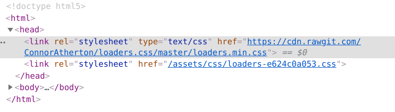

# 自分のサイトにloading画面をつけた話

## 経緯

このサイトはwordpressとか有名所の記事ジェネレーターとかは使えないからMDwikiと言う無料のmarkdownで書けるものを使っていたのだが、MDwikiはjavascriptで書かれているため、処理がパソコンによって変わる。

また、webfontも使っているので読み込みが遅くなり、あまり出したくない部分も表示されてしまうときがある。

そのときに、loading画面があると嬉しいと思ったのでやってみた。

## 準備

調べてみれば、あるある。

それで、今回参考にさせていただいたサイトは[こちら](https://qiita.com/ai230/items/59442d7c7bd076e9fa62)。

```
<div id="loader-bg">
  <div id="loader">
  　
  　<p>Loading...</p>
  </div>
</div>
<div id="contens">
  <p>読み込み完了しました。</p>
</div>
```

```javascript
$(function() {
    var h = $(window).height(); // ブラウザウィンドウの高さを取得する
    $('#contents').css('display','none'); // コンテンツを非表示にする
    $('#loader-bg ,#loader').height(h).css('display','block');//ローディング画像を表示
});
$(window).on('load', function () { // 読み込み完了したら実行する
    $('#loader-bg').delay(900).fadeOut(800);// ローディングを隠す
    $('#loader').delay(600).fadeOut(300);
    $('#contens').css('display', 'block');// コンテンツを表示する
});
```

```css
#loader-bg {
    display: none;
    position: fixed;
    width: 100%;
    height: 100%;
    top: 0px;
    left: 0px;
    background-color: #2b365c;
    z-index: 1;
}
#loader {
    display: none;
    position: fixed;
    top: 50%;
    left: 50%;
    width: 200px;
    height: 200px;
    margin-top: -100px;
    margin-left: -100px;
    text-align: center;
    color: #fff;
    z-index: 2;
}
#contens{
    text-align: center;
    margin-top: 30%;
    font-size: 20px;
    color: white;
}

body {
    background-color: #2b365c;
}
```

この3セットでできるらしい。

## やってみる。

まず、いらない部分を消す。そして、微調整をして色を変える。

こうして...

```
<div id="loader-bg">
  <div id="loader">
  　
  　<p>Loading...</p>
  </div>
</div>
```

こうじゃ！

```css
#loader-bg {
    display: none;
    position: fixed;
    width: 100%;
    height: 100% !important;
    background-color: #ffb35c;
    z-index: 1;
}
#loader {
    display: none;
    position: absolute;
    top: 45%;
    width: 100%;
    height: 250px !important;
    text-align: center;
    color: #fff;
    z-index: 2;
}
```

すっごい短くなった。

`!important`を入れている理由はMDwiki本体内で違う設定にしてしまい、思ったとおりの動作にならなかったから。普通はいらないと思う。

これでいいだろう。

## 装飾。

あとは装飾。参考サイトのやつは悪く言うとダサダサなので修正する。まず、[loaders.css](https://connoratherton.com/loaders)から良さげなロードを探す。

そして、普通はcssをダウンロードand設定するが、面倒くさいから、開発者ツールを使って



こうして...

```
<link rel="stylesheet" type="text/css" href="https://cdn.rawgit.com/ConnorAtherton/loaders.css/master/loaders.min.css">
--- 中略 ---
<div id="loader-bg">
  <div id="loader">
  　
  　<p>Loading...</p>
  </div>
</div>
```

こうして...

```
<div id="loader-bg">
    <div id="loader">
        <h1>Kumitatepazuru's Blog</h1><br>
        <div class="ball-pulse-sync">
            <div></div>
            <div></div>
            <div></div>
        </div>
    </div>
</div>
```

こうじゃ！

`div`がいっぱいあるのはこのcssの仕様。

そうしたら、組み込んで完成ー。そうすると読み込み画面が出る。

## 調整。

フェードアウトの長さ変更はここを変更する。

```javascript
$('#loader-bg').delay(900).fadeOut(800);// ローディングを隠す
$('#loader').delay(600).fadeOut(300);
```

delayは読み込み後も何秒か待って最終調整が終わるのを待つ。

fadeoutはフェードアウトする時間を指定。（どちらもミリ秒）

このブログはこうした。

```javascript
$('#loader-bg').delay(700).fadeOut(800);// ローディングを隠す
$('#loader').delay(700).fadeOut(300);
```

これでちょうどよくなった。

## 最後に

質問等はこちらまで。

https://forms.gle/V6NRhoTooFw15hJdA

また、自分が参加しているRobocup soccer シミュレーションリーグのチームでは参加者募集中です！活動の見学、活動に参加したい方、ご連絡お待ちしております！

[詳しくはこちら](https://kumitatepazuru.github.io/jyo_sen/jp/#!contents/profile.md)