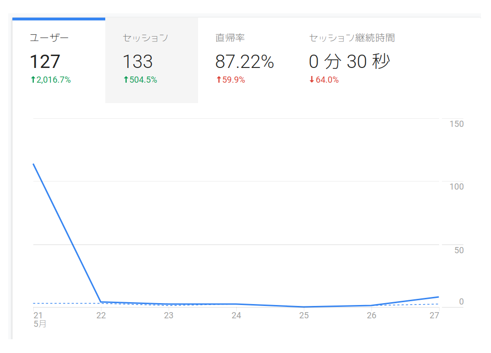

# jyo_senチームの設立者の清水　亮さんにtwitterで紹介されました！

## 経緯

このサイトは[google アナリティクス](https://analytics.google.com/)を使いサイト訪問者を調べている。それで久しぶりにアナリティクスを見てみたら1日だけすごいアクセスが来ていることがわかった。

それでjyo_senチームの皆さんに聞いたところ**jyo_senチームの設立者&株式会社ギリアの社長さん&AIの第一人者の清水 亮さんが[twitter](https://twitter.com/shi3z)で[libscips](https://kumitatepazuru.github.io/blog/#!libscips/program1.md)のリンクを貼った**のだとか。

## 謝辞

清水さん、本当にありがとうございます。このブログもまだ始まったばかりですが、そのような形で支援等をしてくれるのはすごく嬉しいです。ありがとうございます！

## 皆さんへのお願い

ということでみなさんもこのブログを広めてください。まだ始まったばかりですがお願いします！そして、これからもよろしくおねがいします！

## 最後に

これを見たときすごい叫んでましたw。

質問等はこちらまで。

https://forms.gle/V6NRhoTooFw15hJdA

また、自分が参加しているRobocup soccer シミュレーションリーグのチームでは参加者募集中です！活動の見学、活動に参加したい方、ご連絡お待ちしております！

[詳しくはこちら](https://kumitatepazuru.github.io/jyo_sen/jp/#!contents/profile.md)