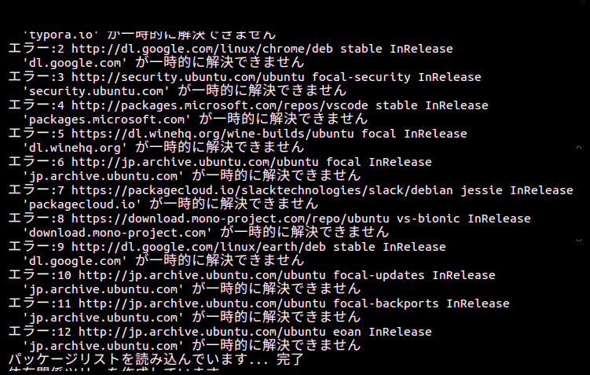

# OSが壊れたから治そうと思ったら手こずった話。

## 経緯

今まで、サブPCを使って作業をしていたが、主PCを使いたくて、linuxを起動してみたら、起動時間が異常に長い。何だこれ。ログインしてから、何も進まない。買ったのも2年前だし、これはなんかあったな。

## 原因を調べる　"アップデート"

早速Ctrl+Alt+F1を押してコンソールモードに入る。コンソールモードは生きていた。そして、まずはソフトウェアのアップデート。これをやると、ソフトウェアが壊れているときも場合によっては治るときがある。windows updateと一緒。コマンドはこんな感じ。

```bash
sudo apt update
sudo apt upgrade
```

これで行けるかな。と思ったら...



e?マジで？

ネットワークに接続できないとのこと。なんでや。

## 原因を調べる　"ネットワーク"

これは予想外のエラー。ダメ元でpingを使ってみる。IPで通ればhostnameがおかしい説が出る。今回のコマンドはこんな感じ。

```bash
ping 8.8.8.8
```

googleのDNSにpingを出す。

そうすると...

```
PING 8.8.8.8 (8.8.8.8) 56(84) バイトのデータ
64 バイト応答 送信元 8.8.8.8: icmp_seq=3 ttl=56 時間=8.16ミリ秒
64 バイト応答 送信元 8.8.8.8: icmp_seq=4 ttl=56 時間=11.4ミリ秒
64 バイト応答 送信元 8.8.8.8: icmp_seq=5 ttl=56 時間=10.9ミリ秒
64 バイト応答 送信元 8.8.8.8: icmp_seq=6 ttl=56 時間=8.93ミリ秒
64 バイト応答 送信元 8.8.8.8: icmp_seq=7 ttl=56 時間=9.29ミリ秒
64 バイト応答 送信元 8.8.8.8: icmp_seq=8 ttl=56 時間=9.26ミリ秒
64 バイト応答 送信元 8.8.8.8: icmp_seq=9 ttl=56 時間=9.18ミリ秒
64 バイト応答 送信元 8.8.8.8: icmp_seq=10 ttl=56 時間=9.11ミリ秒
64 バイト応答 送信元 8.8.8.8: icmp_seq=11 ttl=56 時間=9.30ミリ秒
^C
--- 8.8.8.8 ping 統計 ---
送信パケット数 11, 受信パケット数 9, パケット損失 18.1818%, 時間 10044ミリ秒
rtt 最小/平均/最大/mdev = 8.162/9.502/11.416/0.947ミリ秒
```

返ってくるんかい。だったらhostnameがおかしい？

だったら次のコマンドでhostnameが生きているか確認。

```bash
systemctl status hostname
```

見てみると動いていない。謎のエラーを吐き出している。スクショ撮ってないから忘れたけれどなんかやばい。少しこれはおいておく。次は、起動が遅かった原因を調べてみる。

## 原因を調べる　"起動問題"

まず、重いプロセスが走っていないかhtopで確認。

そうすると、htopが動かない。なんで？見てみるとsnapが正常に動いていないらしい。マジか。これはだんだんやばくなってきた。一度リカバリーモードで起動してみる。

GRUBからAdvanced options for Ubuntuを選択。起動するバージョン名の後ろに`(recovery mode)`と記載されている項目を選択。そうするとリカバリーモードで起動する。でもその起動時におかしなエラーを発見。hostnameサービスが死んでいる。他にもファイルがなかったり危険なエラーが多発している。

いろいろ調べてみるとetcの部分のファイルが一部なくなっている。これでは起動できないのは当たり前だ。でもギリギリ起動に必要なファイルはあったぽい。なんでやろ。


## 原因を調べる　"ファイル消失問題"

まずHDDがやられてないか確認。やられてたらやばい。一旦windowsを起動して[CrystalDiskInfo](https://crystalmark.info/ja/software/crystaldiskinfo/)を使って確認。でも問題はない。じゃあパーティションが何かの拍子に壊れたか？もう一度レスキューモードにしてパーティションを確認してみる。

```bash
fsck /dev/nvme0m1p4
```

でも、問題はない。だったら、意図的にファイルが消されたことになる。あ...もしかして....

## 結論

### すごいやらかしました。これで5回目です。

少し前に容量が足りなくて/varらへんのキャッシュ系を消していた。その中に/etcのシンボリックリンクがあってそこまで消されたのだろう。**これで5回目。**

## 再インストール

再インストールをしなくてはいけない。ちょっとzorin osのバグが気になってたときだしubuntuに乗り換えようと思う。バージョンは20.04LTS。1ヶ月前にリリースされたものだ。(5/20現在)

ということで再インストールしようと思ったら次のエラーが。

```
GRUBを/dev/nvme0n1p4 にインストールできません。

grub-install /dev/nvme0n1p4 の実行に失敗しました。
これは致命的なエラーです。
```

マジかー。このパソコンと相性的な何かが悪いのは知っていたがまたか。再起動したらgrubのレスキューモードになっている。

## GRUB復旧

[このサイト](https://flyan495.tumblr.com/post/159323036196/grub-rescue%E3%82%92%E3%81%AA%E3%82%93%E3%81%A8%E3%81%8B%E3%81%99%E3%82%8B)にしたがってやってみたけどだめ。

```
set prefix=(hd0,msdos4)/boot/grub
insmod (hd0,msdos4)/boot/grub/normal.mod
```

しょうがないから再起動したら起動できた。なんでや。

## まとめ

再起動大事。システムファイルはキャッシュでも消さない。＜これ大事

それでは、またいつか。


質問等はこちらまで。

https://forms.gle/V6NRhoTooFw15hJdA

また、自分が参加しているRobocup soccer シミュレーションリーグのチームでは参加者募集中です！活動の見学、活動に参加したい方、ご連絡お待ちしております！

[詳しくはこちら](https://kumitatepazuru.github.io/jyo_sen/jp/#!contents/profile.md)