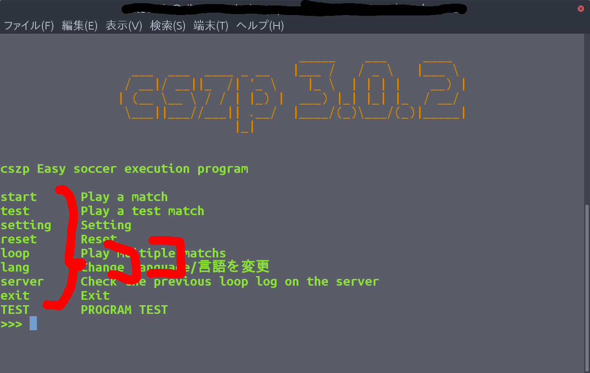

# How to create a plug-in

It's also very easy to build plug-ins. First, you need the following files:.

  * Root directory (The plug-in is built in here.)
  * setup.json (I'm going to put all the information I need here.)
  * list.json (I'm going to put some text here.)
  * \_ \_ init __. py (This is where you put the program. You can also call other programs.)
  * en _ us.lang ja _ jp.lang (Language file.)

Let me explain one by one.

## setup.json

Create setup.json directly under the root directory. This is where you write the author's information.
This is an example of the contents.

```json
{
    "name": "test program",
    "version": "1.0.0",
    "author": "kumitatepazuru",
    "author_email": "teltelboya18@gmail.com",
    "description": "THE TEST PROGRAM"
}
```

each meaning

* name: The name of the plug-in
* version: plug-in version
* author: the name of the author
* author_email: The email address of the author
* description: Simple description

If this is not all written, cszp will not recognize it as a plug-in.

## list.json

list.json writes commands to display, etc. This file should also be created directly under the root directory.
This file is recognized by cszp_module.terminal.question.

This is an example of the contents.

```json
{
  "menu": [
    {
      "title": "TEST",
      "description": "PROGRAM TEST",
      "cmd": "TEST"
    }
  ]
}
```

The structure is a little difficult. each meaning

* menu: where to display. Currently, the home screen (menu) setting screen (setting) is supported as a standard.
* title: The display portion of the command. As shown in the image
* description: A brief description of the command. As shown in the image
* cmd: This is the actual command. When this is entered, the plugin function in the specified program is called.

It's like this.

note: cszp startup behavior (From ver 4.1.10) <br>
The following program in list.json causes cszp to call the autostart function (Class) in \_\_init __. py, described below. You can set the default here.

```json
"auto_start":[
    {"cmd": "auto_start"}
]
```

##  \_\_init__.py

The plugin function (Class) is called.
The argument is (Argument names are examples).

* lang: cszp_lang class data. Used primarily for translating lang.lang from lang files.
* input_cmd: Uses the command specified by the user. It is always the plugin function (Class) that is called when a different command is given, so it can be used to determine.

must be specified.
This is also created directly under the root directory. The actual call command

```python
sys.path.append(lang.functo("menu", inp)[0])
plugin = import_module(lang.functo("menu", inp)[1])
reload(plugin)
try:
    plugin.plugin(lang,inp)
```

dialogue box opens. * For menu plug-in

## en_us.lang and ja_jp.lang

Language file. It is similar in structure to a po file.
This program is created in the language directory in the root directory, not the root directory.
is recognized by the lang.lang() function.

It's very easy to write. Here's an example.

```
cszp 簡単サッカー実行プログラム
cszp Easy soccer execution program

試合をする
Play a match

テスト試合をする
Play a test match

設定をする
Setting

リセットをかける
Reset

試合を複数回する
Play multiple matchs
```

All you have to do is write the text you want to translate above and the translated text below.
You can write any comment as long as it doesn't cover the text you want to translate.

Note: Even if the untranslated sentence and the translated sentence are the same string, please write it. There is a way not to write it, but it is not recommended.
The function was originally created to avoid errors.
Also, it is possible not to create a file in the same language as the one before and after translation, but it is not recommended for the reason above.

Now the way to build a plug-in is master.

The following is a list of standard commands that can be used with plug-ins without installation.

