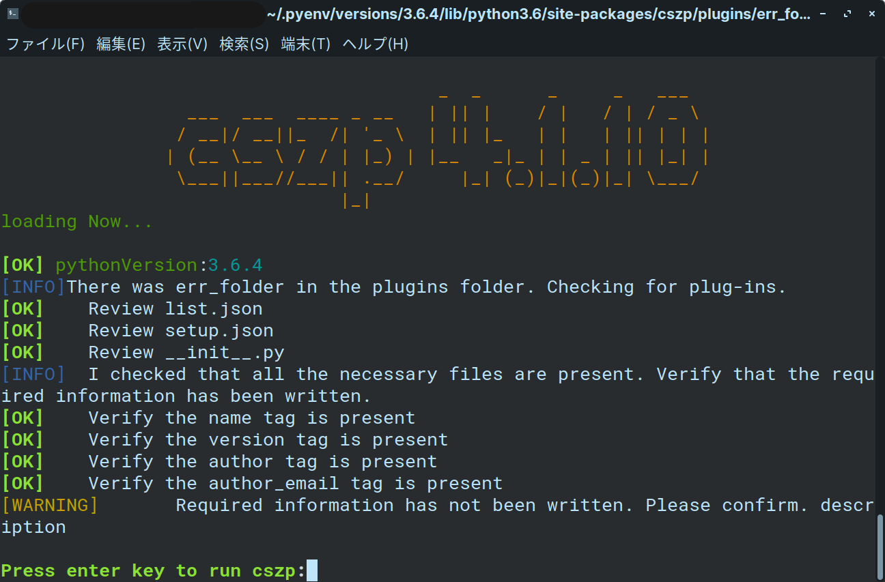
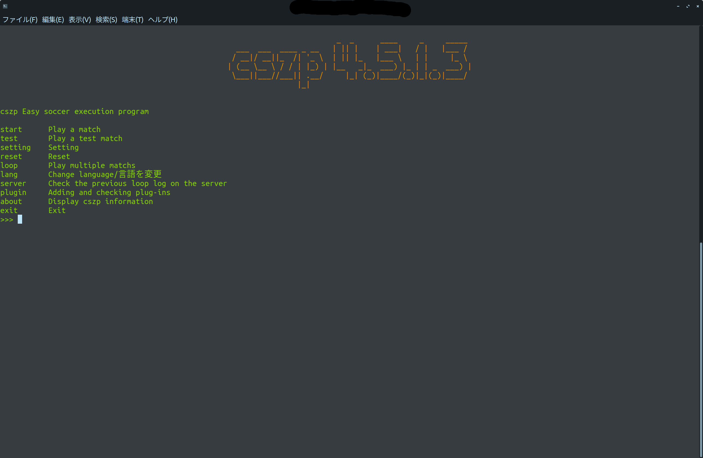

# Basic Usage

cszp is a program that can be run interactively. So you can do it just by answering the questions.

Let's take a look.

Hint: 
If the program stops with a warning similar to the one on the side, you can execute it by pressing Enter.
The cause appears if there are extra or unexecutable plug-ins in the plugins folder.

## Menu Window(cszp_menu.py)

This is the home screen. The command and description are written above.
For detailed descriptions of commands

* Run start ....... rcssserver. The required arguments are automatically filled in by the questions that follow.
* It is similar to the test ........ start command, but it is designed to check whether a program is executable or executable. The game time is set to 200 ticks.
I'll explain this later.
* setting ... Sets the cszp setting. I'll explain the details later.
* If the reset ...... configuration file becomes corrupted or fails to start, use this command to initialize the configuration. It cannot be restored.
* If you run loop ....... rcssserver a specified number of times and set the results, it saves them to a csv file. You can also configure synch mode to run. I'll explain later.
* lang ....... Change the language. The languages we support now are Japanese and English.
* server .... Allows you to see the data from previous matches. I'll explain later.
* You can view and install plugin .... plugin information. I'll explain this later.
* You can check about ..... cszp and PC information and installation.
* exit ......... Exit the program.

*Some plug-ins have more commands. Check the plug-in site for details of the command.

The menu screen looks like this. Right? It looks easy to use, doesn't it? The following is a quick look at the start, test, and loop commands. You don't like to read a lot, do you? Because the functions are the same, the questions are almost the same. That's why I can explain it all at once.