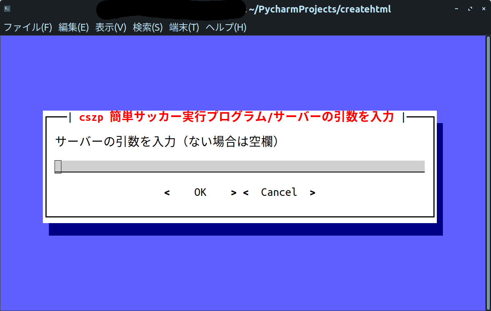

# Using the start test loop Command (cszp _ soccer.py)

Note: This wiki is based on cszp 4.5.0 If you are using version 4.5.0 or earlier, please upgrade.

Here's how to use cszp with the start, test, and loop commands.
Since cszp is an interactive execution system, it is very easy to execute by answering questions. Let's take a look!

## 1.Check settings (Common to each command)

First, check the setting. Check the configuration for problems. If there is a problem, select cancel and go back to the menu screen to reconfigure.

You can use the arrow keys, tab and space keys, and a mouse click.

## 	2.Select Team1 (yellow) Team Path (Common to each command)
Then select the path to Team1's yellow team.
If you have a player on the cszp short list (To be described later), select Yes and go to 3.
If you have not registered, select No and go to 3.5.
If you want to make changes, select Cancel to return to the previous screen.
The way to choose is the same as before.

## 	3.Select from Easy soccer playlist

Hint: If you see something like this, the player is not on the list. Press Ok to select the executable from the file or Cancel to reset.

Use the space bar to select. When finished, press Tab to select Ok. The mouse reacts to this part.

## 	3.5.Select from File

Hint: If you see a screen like the one below, either increase the size of the screen or decrease the font size.

Use the arrow keys to select a file. Note that you cannot use a mouse on this screen. Press the q key to change or reset the selection method. You can also search by pressing F4 or Ctrl + F or Command + F.

## 	4.Select Team2 (Red) Team Path (Common to each command)

Please do it the same way as setting up the yellow team.

## 	5.Enter server arguments (Common to each command)

Enter server arguments. If not, leave blank and select Ok. Also, synch mode arguments are automatically entered, so it's okay.

## 	6.Various settings (Common to each command)

Various settings. Select as needed.

## 	7.csv file name (Each command common csv log save mode only)

This screen only appears if you select Yes to save the csv log. Please specify a name to save.

## 	8.Specify the number of loops (Only when the loop command is executed)

Appears only when the loop command is executed. Set the number of loops in half-pitch.

## 	9.Verify (Common to each command)

This is the last confirmation. Check for problems. Select Yes if you are satisfied.

## 	10.Run (Common to each command)

Hint: If you see something like this, the program is wrong or the path is wrong. Please confirm.
Execute. Press Enter to return to the home screen after successful completion without an error.

The start test loop command is now used as a master. I wrote it a little carelessly, but I think it was easy to understand because of the easy-to-see CUI. Next, I will introduce the setting screen. Bye!