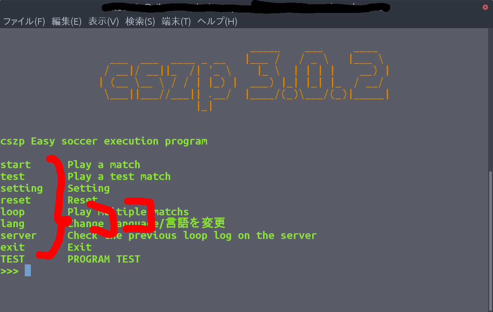
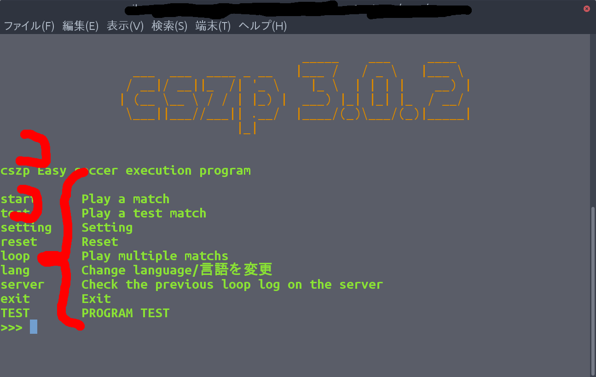

# プラグインの作り方

プラグインの作り方もすごくかんたんです。まず、以下のファイルが必要です。

* ルートディレクトリ （プラグインはこの中で作ります。）
* setup.json （ここに必要情報を詰め込みます）
* list.json （ここに表示文などを詰め込みます）
* \_\_init__.py （ここにプログラム本体を詰め込みます。また他のプログラムの呼び出しも可能です）
* en_us.lang ja_jp.lang（言語ファイルです）

では1つずつ説明していきます。

## setup.json

setup.jsonはルートディレクトリの直下に作成します。作成者の情報などを書くところです。  
中身の例としてはこのような感じです。

```json
{
    "name": "test program",
    "version": "1.0.0",
    "author": "kumitatepazuru",
    "author_email": "teltelboya18@gmail.com",
    "description": "THE TEST PROGRAM"
}
```

意味はそれぞれ

* name        : プラグインの名前
* version     : プラグインのバージョン
* author      : 作成者の名前
* author_email: 作成者のメールアドレス
* description : かんたんな説明

です。これがすべて書かれていないとcszpはプラグインとして認識をしません。

## list.json

list.jsonは表示するコマンドなどを書き込みます。このファイルもルートディレクトリの直下に作成します。  
このファイルはcszp_module.terminal.questionで認識されます。

中身の例としてはこのような感じです。

```json
{
  "menu": [
    {
      "title": "TEST",
      "description": "PROGRAM TEST",
      "cmd": "TEST"
    }
  ]
}
```

少し構造が難し目です。意味はそれぞれ

* menu : どこで表示するか。いま標準対応しているのはホーム画面(menu)設定画面(setting)です。
* title : コマンドの表示部分です。画像で示すと
* description : コマンドのかんたんな説明を書きます。画像で示すと
* cmd : 実際のコマンドです。これが入力されるとその指定のプログラム内のplugin関数が呼び出されます。

こんな感じです。

note: cszp起動時の動作について(ver 4.1.10から)<br>
list.jsonに以下のようなプログラムを入力すると、cszpの起動時に、次に説明する\_\_init__.pyのautostart関数（クラス）が呼ばれるようになります。初期設定はこちらで設定すると良いでしょう。
```json
"auto_start":[
    {"cmd": "auto_start"}
]
```

##  \_\_init__.py

この中のplugin関数（クラス）が呼び出されます。  
引数に（引数の名前は例です）

* lang : cszp_langクラスのデータです。主にlang.langのlangファイルからの翻訳に使われます。
* input_cmd : ユーザーが指定したコマンドを使います。違うコマンドを指定しても呼ばれるのはいつもplugin関数(クラス）なので判別するのに使えると思います。

を指定してください。  
これもルートディレクトリの直下に作成します。実際の呼び出しコマンドは

```python
sys.path.append(lang.functo("menu", inp)[0])
plugin = import_module(lang.functo("menu", inp)[1])
reload(plugin)
try:
    plugin.plugin(lang,inp)
```

です。※メニュープラグインの場合

## en_us.langとja_jp.lang

言語ファイルです。poファイルと構造が似ています。  
このプログラムはルートディレクトリではなくルートディレクトリ内のlanguageディレクトリに作成します。  
lang.lang()関数で認識されます。

書き方はとてもかんたんです。例としてはこのような感じです。

```
cszp 簡単サッカー実行プログラム
cszp Easy soccer execution program

試合をする
Play a match

テスト試合をする
Play a test match

設定をする
Setting

リセットをかける
Reset

試合を複数回する
Play multiple matchs
```

書き方は上に翻訳をかけたい文字列、下に翻訳後の文字列を書くだけです。  
コメントは翻訳をかけたい文字列にかぶっていなければ何を書いても大丈夫です。

Note: もし、翻訳前の文と翻訳後の文が同じ文字列だとしても書いてください。一応書かないという手はありますが、非推奨です。  
そもそもその機能はエラー回避のために作成した機能です。  
また、翻訳前の言語と翻訳後の言語が同じ言語ファイルをそもそも作成しないことも可能ですが上記の理由により、オススメしません。

これでプラグインの作り方はマスターですw次はプラグインでインストール無しで使える標準コマンドを紹介します。