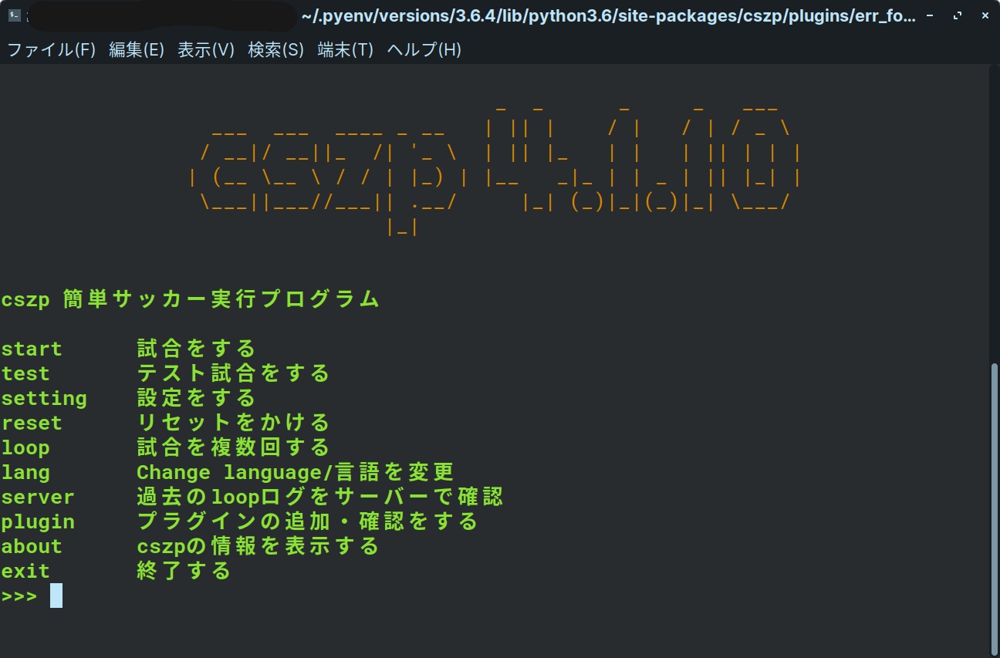

# 基本的な使い方

cszpには対話式で実行できるプログラムです。なので質問されたことを返答するだけで実行ができるようになります。

では見ていきましょう。

Hint: 
もし、横の画像に似たような警告が出てプログラムが止まる場合はEnterキーを押すと実行できます。  
原因としてはpluginsフォルダの中に余計なものまたは実行できないプラグインが存在する場合に表示されます。

## メニュー画面(cszp_menu.py)

これがホーム画面です。上にコマンドと説明が書かれます。  
コマンドの詳しい説明は

* start.......rcssserverの実行をします。事前に必要な引数はこのあとも説明する質問により自動入力されます。
* test........startコマンドと似ていますが、これはプログラムが実行可能か、または実行できるかを確認できるように作られています。試合時間が200tickに設定されています。  
    こちらも後ほど説明します。
* setting...cszpの設定をします。詳しくは後ほど説明します。
* reset......設定ファイルが破損したりして起動できなくなった場合、このコマンドを使い設定を初期化します。復元はできません。
* loop.......rcssserverを指定した回数実行し、結果を設定した場合、csvファイルに保存してくれます。synchモードの実行も設定すれば可能です。後ほど、説明します。
* lang.......言語を変更します。いま対応している言語は、日本語と英語です。
* server....過去に試合したデータを確認することができます。後ほど説明します。
* plugin....プラグイン情報を表示・インストールをすることができます。こちらも後ほど説明します。
* about.....cszp・PCの情報・インストールが確認できます。
* exit.........プログラムを終了します。

※プラグインのものによってはコマンドが増えている場合があります。そのコマンドの詳細はプラグインのサイトを確認してください。

メニュー画面はこんな感じです。ね？使いやすそうでしょ？次は、startコマンド・testコマンド・loopコマンドを一気に解説します。みなさんも大量の文を読むのは好きじゃないでしょ？関数が一緒だからほぼ質問が一緒なんですよ。だから一気に解説できるんですよ。