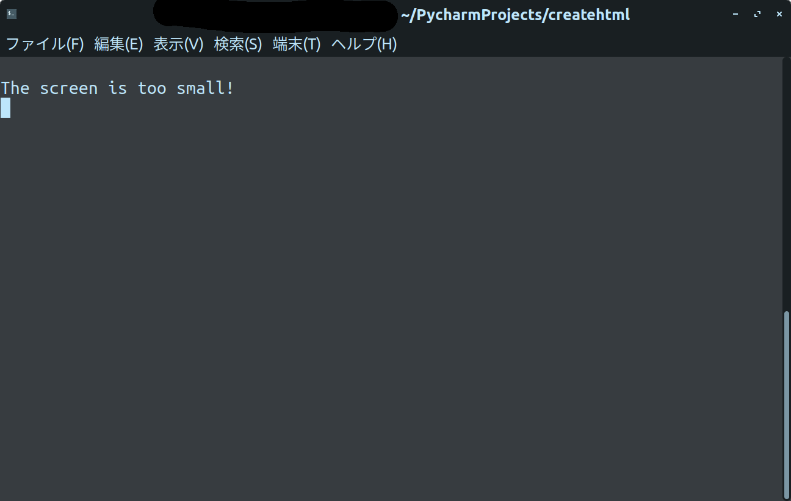
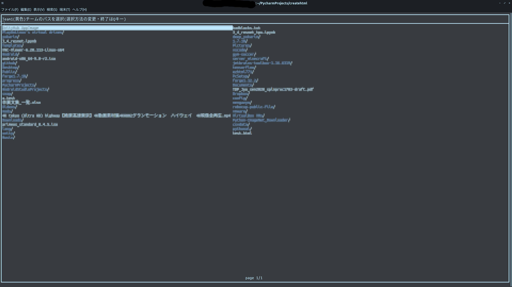
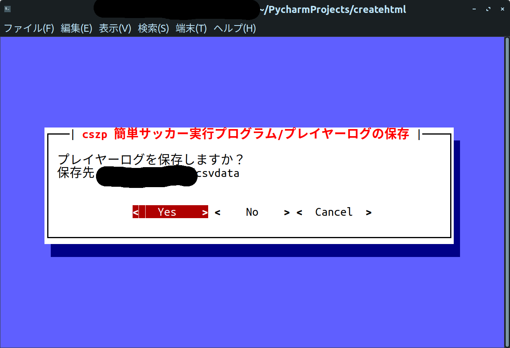
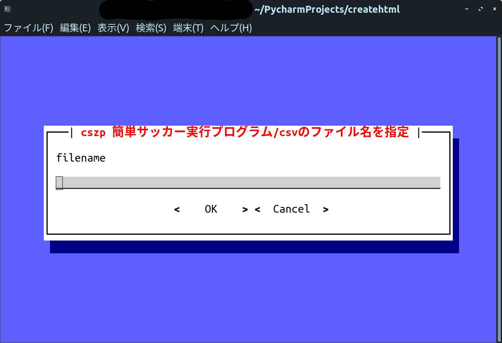
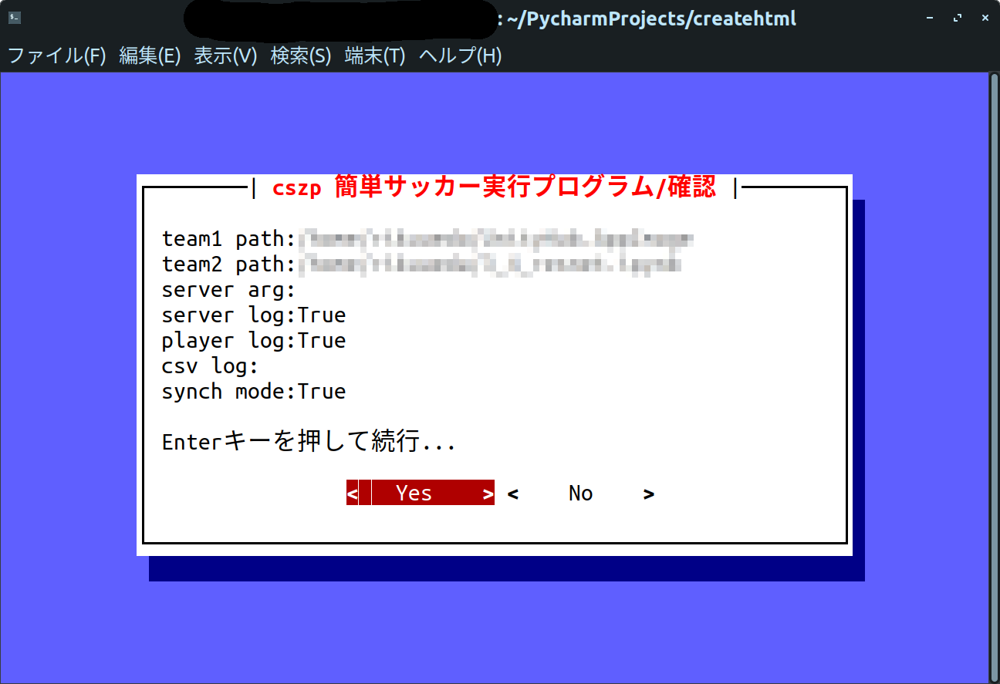

# start・test・loopコマンドの使い方(cszp_soccer.py)

note: このwikiはcszp4.5.0以降を基準に作られています。4.5.0以前のバージョンを使っている方はバージョンアップをしてください。

今回は、cszpの使い方のstart・test・loopコマンドの使い方について説明しようと思います。  
cszpは対話式の実行システムにしているので実行も質問を答えるだけですごく簡単に実行することができます。では見ていきましょう！

## 1.設定確認(各コマンド共通)

まずは設定確認です。設定に問題がないか確認しましょう。もし、問題がある場合はcancelを選択してmenu画面に戻って再設定してください。  
選ぶのは矢印キーとTabキー・スペースキーあと、マウスクリックが使えます。

## 	2.Team1(黄色)チームのパスを選択(各コマンド共通)

次にTeam1の黄色チームのパスを選択します。  
もし、cszpの簡単サッカー実行リスト（後述）に選手を登録している場合はYesを選んで3へ進んでください。  
登録していない場合はNoを選んで3.5へ進んでください。  
また、変更をしたくなった場合はCancelを選択すると一つ前の画面に戻れます。  
選び方は先程と変わりません。

## 	3.簡単サッカー実行リストから選択

Hint: もし、以下のような表示がされたときは選手がリストに設定されていません。Okを押してファイルから実行プログラムを選択するかCancelを押して再設定し直してください。

スペースキーで選択ができます。できたら、Tabを押してOkを選択してください。この部分はマウスが反応します。

## 	3.5.ファイルから選択

Hint: もし、以下のような画面が表示された場合は画面のサイズが小さいので大きくするか、フォントの大きさを小さくしてください。

方向キーでファイルを選択してください。この画面ではマウスは使用できないので注意してください。qキーを押すと選択方法を変更・再設定ができます。また、F4キーまたはCtrl+FまたはCommand+Fで検索ができます。

## 	4.Team2(赤色)チームのパスを選択(各コマンド共通)

黄色チームの設定と同じやり方でやってください。

## 	5.サーバーの引数を入力(各コマンド共通)

サーバーの引数を入力してください。もしない場合は空欄でOkを選択してください。また、synchモードの引数は自動入力してくれるので大丈夫です。

## 	6.各種設定(各コマンド共通)

各種設定です。必要に応じて選択してください。

## 	7.csvのファイル名を指定(各コマンド共通・csvログ保存モードのみ)

csvログの保存をYesにした場合のみ表示される画面です。保存する名前を指定してください。

## 	8.loop回数を指定(loopコマンド実行時のみ)

loopコマンド実行時のみに表示されます。ループ回数を半角で設定してください。

## 	9.確認(各コマンド共通)

最後の確認です。問題がないか確認してください。問題がなければYesを選択してください。

## 	10.実行(各コマンド共通)

Hint: もし以下のような画面が表示されたら、プログラムがおかしいまたはパスが間違っています。確認をしてください。
実行をします。エラーが出ずに正常終了したら、Enterキーを押してホーム画面に戻ってください。

これでstart・test・loopコマンドの使い方はマスターですw。少し雑に書きましたが、見やすいCUIで分かりやすかったと思います。次は、setting画面の紹介をしようと思います。それでは！